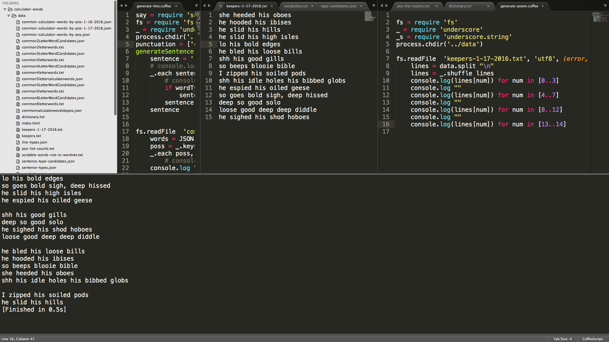
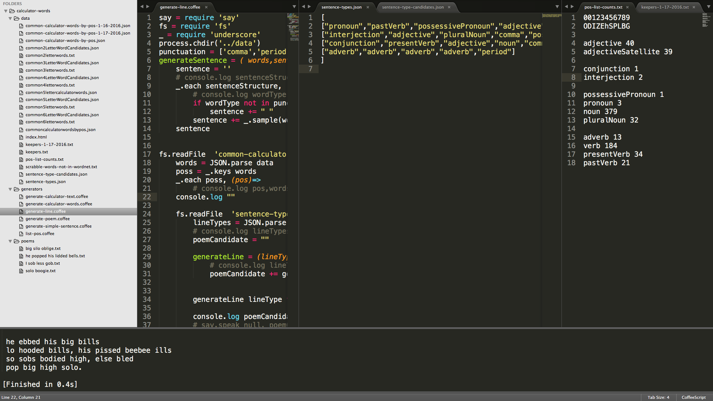

# calculator-words
For generating poetry from common words that can be typed into an inverted calculator using the number keys. 

I recently rediscovered my TI-30 SLR+ solar calculator that I first took to college in 1988. A perfrectly awesome calculator on which one could type AOS the Algebraic Operating System. A calculator that came with no battery, just a solar panel and a capaciter that could charge up with light and glow an 8 character LED display. A 28 year old calculator that has operated flawlessly all that time with no sign of flagging. The device is as effective now as it was then. 

This brought back a flood of memories, the many hours spent studying that face, solving equations. I remembered the old calculator trick where you can flip the numbers upside down and form letters. Alex mentioned George Perec's E-prime novels. Why not, how many words can there be. 

My first thought was not to google it. I've been studying a bit of Algebra on Khan Academy and I guess I want to apply math to a problem, so I though I might sort out a way to generate a list of all the words that can be typed upside down on a calculator. And then I thought I might take a series of photographs of my newly rediscovered calculator in various poses displaying the words of a poem in sequence upside down. Here's what I did:

Generate a list of all possible 2-6 character sequences of the characters: 

ODIZEhSPLBG

00123456789

The upside down version of the numerals. Then I found a list of common 2-6 letter scrabble words:

http://www.poslarchive.com/math/scrabble/lists/common-234.html

http://www.poslarchive.com/math/scrabble/lists/common-5.html

http://www.poslarchive.com/math/scrabble/lists/common-6.html

I took the intersection of the sets using http://underscorejs.org which took a long time, some good statistics started to emerge. This strict vocabulary of letters provided a surprisingly baudy set of choices, as if the inventors of the calculator forsaw the depths of 4th grade humor. I wanted to make aesthetic choices at every step through this process so when I got to a viable set of word choices, what I would call common words of 2-6 characters that can be displayed inverted upon a calculator. 

I chose to process the data once more through the wordnet database:

https://wordnet.princeton.edu/

For those words I could match i extracted the parts of speech. I thought I would diagram the parts of speech of some of Ezra Pounds poetry that abided the strictly limited vocabulary afforded by the calculator's inverted interface. From among those words that did not fit the imediate interface of Wordnet, I hand picked those I still felt had poetic potential and reintroduced them into the vocabulary using a more nuanced vocabulary accounting for tense. With the discovery of a viable conjunction, I set to work.

The code is almost ritualitsticly verbose in that I wanted to "show my work" as I went through a thought process, without accounting for optimization, only for the gratifications of the results. I wanted to get to something that felt meaningful and also seemed derived of the awkwardness of the strange constraint. The final vocabulary is only about 400 words that feel both poetically viable and doable inverted on the TI-30 SLR+.

